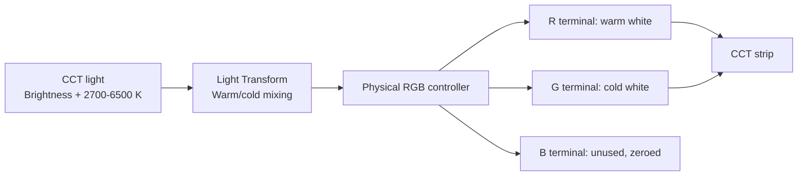
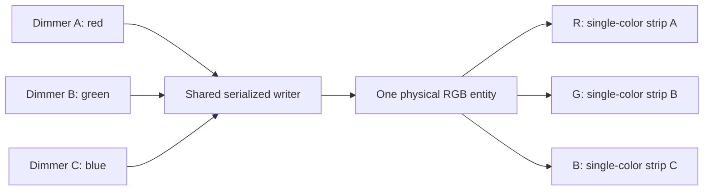
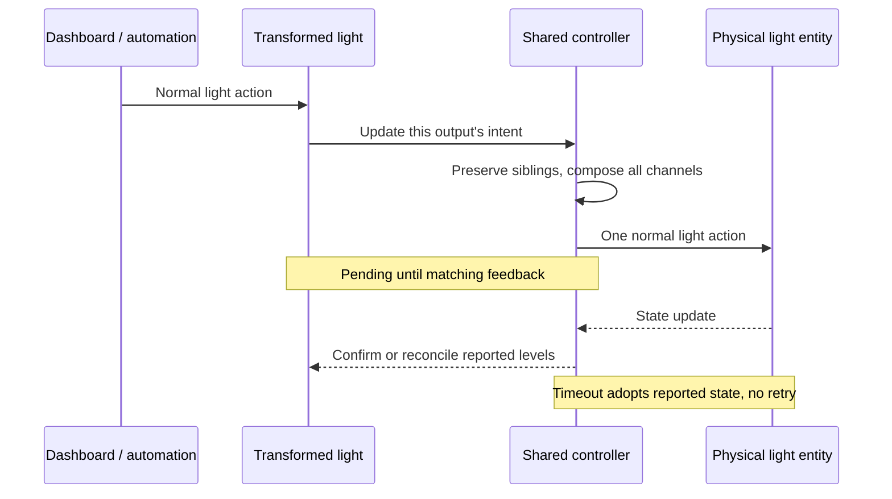
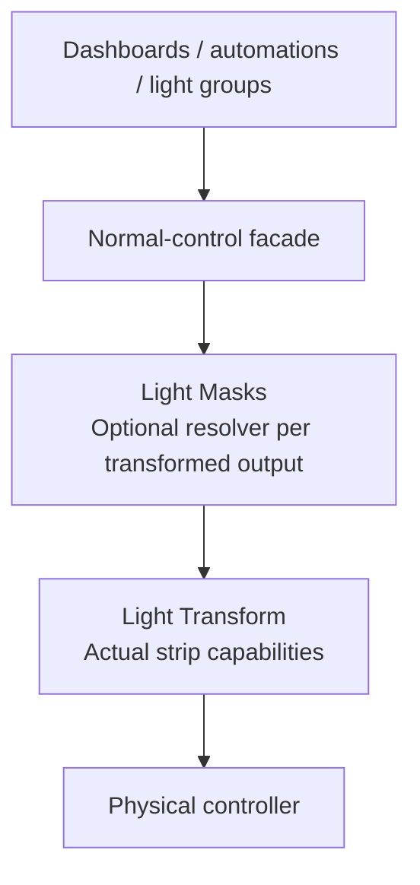

<p align="center">
  
</p>

# Light Transform

English | [Українською](README.uk.md)

Expose what is **connected to a controller**, not what the controller advertises.

A Home Assistant custom integration that maps a physical light's channels to
ordinary CCT or brightness-only light entities. Inspired by Light Masks' virtual
light approach, but responsible for **capability and channel conversion**, not
automation priorities.

**Version:** 0.2.0. **Minimum Home Assistant:** 2026.9.3.
**Configuration:** native UI flows and output subentries. No YAML or custom actions.

## Supported mappings

| Source transport | Virtual output | Configuration |
| --- | --- | --- |
| RGB, HS or XY | CCT with dimming | Warm/cold R/G/B channels, Kelvin endpoints, mixing rule |
| RGB, HS or XY | One dimmer | One or more R/G/B channels, driven equally |
| RGB, HS or XY | Up to three independent dimmers | One output subentry per channel |
| RGB, HS or XY | CCT plus one independent dimmer | Two channels for CCT; remaining channel for dimmer |
| Native CCT | One dimmer | Fixed source color temperature |
| Native CCT, including RGB+CCT controllers | One CCT-only light | Pass through brightness and temperature; hide RGB and effects |

Channels cannot overlap. One integration entry exclusively owns one physical
source. Native CCT transport uses the source's brightness and color-temperature
interface; it does **not** expose independent electrical warm/cold outputs.
RGBW/RGBWW-only sources are not supported in this version.

## Install and configure

### Install through HACS (recommended)

Requires Home Assistant **2026.9.3 or newer** and a working
[HACS installation](https://www.hacs.xyz/docs/use/download/download/).
Light Transform is available as a **custom repository**, not in the default HACS
catalog.

[](https://my.home-assistant.io/redirect/hacs_repository/?owner=gigazet&repository=ha_light_transform&category=integration)

Use the button above to open the repository in your Home Assistant instance and
confirm adding it, or add it manually:

1. Open **HACS** in the Home Assistant sidebar.
2. Open the **three-dot menu** in the upper-right corner and select
   **Custom repositories**.
3. Enter `https://github.com/gigazet/ha_light_transform`, select type
   **Integration**, and click **Add**.
4. Close the dialog, search for **Light Transform**, and open its repository page.
5. Click **Download**, review the version offered, and confirm. When there is no
   tagged release, HACS installs the default branch; a short commit ID as the
   version is normal.
6. **Restart Home Assistant** after the download. Reloading the browser or YAML
   alone does not load a newly installed custom integration.
7. Continue with **Configure Light Transform** below. Downloading through HACS
   installs the files; it does not create a controller or transformed lights.

For updates, open Light Transform in HACS, install the offered update, then
restart Home Assistant. If an expected update is missing, use the repository's
three-dot menu > **Update information**, then check again.

### Manual installation

1. Copy the `light_transform` directory inside this project's `custom_components`
   into the Home Assistant configuration's `custom_components` directory.
2. Restart Home Assistant, then follow the configuration steps below.

### Configure Light Transform

1. Open **Settings > Devices & services > Add
   integration > Light Transform**.
2. Name the controller, choose its physical `light.*`, and select **RGB channels**
   (`rgb`) or **Color temperature** (`cct`) transport. Use `rgb` for RGB/HS/XY channel mapping, even if the source also
   advertises color temperature.
3. On the integration page, choose **Add transformed output**. Each output is a
   native config subentry with its own device and stable light entity.
4. Choose **Dimmer** (`dimmer`) or **Tunable white** (`cct`). Dimmer uses only **Dimmer channels**; CCT uses only
   **Warm channel**, **Cold channel**, the Kelvin endpoints and mixing rule.
   With `cct` transport, choose **Dimmer** for fixed temperature or **Tunable white**
   for adjustable native CCT. Native tunable white ignores fixed temperature and
   uses the source's advertised Kelvin range; no RGB channels or mixing are involved.
5. Use the generated entity in dashboards, automations, scenes and light groups.
   Edit or delete individual outputs using their subentry menu.

The first setup creates a controller **without outputs**. It does not change the
physical light. Adding, editing, deleting, reloading and restarting also send no
hardware commands. Switch the source off before changing wiring or channel
assignments. Deleting an output does not turn its connected strip off; the next
command to a remaining output clears unassigned RGB channels.

### Missing integration or artwork

If Light Transform does not appear under **Add integration**, first restart
Home Assistant after downloading, then refresh the browser. Check the Home
Assistant logs if it is still missing.

The **README banner** and the **integration icon** use different paths:

- The banner uses a public, absolute image URL so it works in GitHub and HACS.
  Relative HTML `img` paths are not rewritten by the HACS README renderer.
- Integration icons and logos are bundled in
  `custom_components/light_transform/brand`. Home Assistant 2026.3+ supports
  local brand assets; this project's minimum version already includes that
  support. Finish installation and restart HA before expecting those assets
  to be available, then hard-refresh the browser.

Some HACS frontend versions use the central Home Assistant brands service for
their repository-list icons rather than the locally installed brand assets.
A missing list icon in such a version does not mean the integration or its
README banner is broken; a README image or `hacs.json` setting cannot change
that frontend behavior.

Source and documentation: [gigazet/ha_light_transform](https://github.com/gigazet/ha_light_transform).
Report problems using the [issue tracker](https://github.com/gigazet/ha_light_transform/issues).

## Generic configuration examples

All names, entity IDs and temperatures below are illustrative, not installation
data. Configure these mappings in the UI; they are **alternatives**, except where
multiple outputs explicitly share one controller. Entity IDs depend on the names
you choose and on existing entries in your entity registry.

| Scenario | Source and transport | Output settings | Exposed controls |
| --- | --- | --- | --- |
| RGB controller + CCT strip | `light.rgb_controller`, `rgb` | CCT; warm **red**, cold **green**; 2700-6500 K; `constant_sum` | On/Off, brightness, temperature |
| RGB controller + single-color strip | `light.rgb_controller`, `rgb` | Dimmer; **red** | On/Off, brightness |
| CCT controller + fixed-white load | `light.cct_controller`, `cct` | Dimmer; fixed **3000 K**, inside the source's supported range | On/Off, brightness; 3000 K sent on every On |
| RGB+CCT controller + strip on native CCT terminals | `light.rgb_cct_controller`, `cct` | Tunable white; source temperature range | On/Off, brightness, temperature; no RGB picker or effects |
| RGB controller + three single-color strips | One `light.rgb_controller`, `rgb` | Three output subentries: **red**, **green**, **blue**, one channel each | Three independent dimmers |
| RGB controller + CCT and single-color strips | One `light.rgb_controller`, `rgb` | CCT on **red + green**, dimmer on **blue** | Independent CCT light and dimmer |
| RGB controller + synchronized single-color loads | `light.rgb_controller`, `rgb` | One dimmer selecting **red + green** | One slider drives both channels equally |

Use the channel assignments and temperatures that match the **actual wiring and
strip specifications**. Channel names describe controller terminals, not the
light emitted by the connected load. Only connect electrically compatible loads
within the controller, wiring and power-supply ratings.

Do not use the source's advertised CCT range as evidence of the connected strip's
range. A controller's advertised capabilities describe its firmware, not its load.
Native CCT passthrough preserves the controller's existing temperature scale; it
does not calibrate the connected strip or remap RGB terminals. Existing native-CCT
dimmers retain their fixed-temperature behavior when upgrading from 0.1.0.

### RGB to tunable white



With 2700 K and 6500 K endpoints, the midpoint is **4600 K**. At 50% brightness,
`constant_sum` requests approximately 25% warm and 25% cold channel drive;
`constant_max` requests approximately 50% on each. Values are quantized to 8-bit
levels. These are drive ratios, not measured light output.

### Three independent dimmers on one controller



Create one controller entry and three **Add transformed output** subentries,
not three controller entries. In **Developer tools > Actions**, call the normal
`light.turn_on` action on the generated dimmer A entity with `brightness_pct: 25`,
then dimmer B with `brightness_pct: 60`. Turning dimmer A off preserves B's 60%
level. Turning the final active output off sends physical Off.

### Channel accuracy warning

Some controllers advertise **`xy` or `hs` rather than native `rgb`**.
HA accepts `rgb_color` actions and converts them to the source's supported
representation. HS/XY conversion, firmware gamut clipping, gamma and hardware
calibration may mix channels or change their intensity. Native RGB is preferable
but still depends on the device honoring channel ratios.

An XY/HS source is explicitly marked `approximate_channel_control: true`.
Feedback is an estimate from HA-reported RGB plus global brightness, not a
measurement of the electrical outputs. Verify actual channel isolation at low
brightness before using separate loads. This integration is not a direct PWM
driver and cannot make a color-managed controller electrically exact.

## Behavior

- CCT outputs advertise only `color_temp`; dimmers advertise only `brightness`.
  Standard On/Off, Toggle, brightness percentages/steps, Kelvin, HA scenes and
  light groups work through the normal light domain.
- A single serialized writer composes all sibling outputs. Turning one off
  zeroes its channels, preserving the others; physical Off is sent only when
  all assigned outputs are off. Unassigned channels are zeroed on every write.
- Plain On remembers the last nonzero brightness and, for CCT outputs, temperature.
  These values persist across restarts; **On state is never restored from storage**.
  Startup adopts the current physical source without writing to it.
- Source changes update the virtual lights. Missing, unknown or unavailable
  sources make outputs unavailable. An On source in an incompatible color mode
  also makes them unavailable; turn the source off or restore its selected mode
  to recover. Sources returning from an outage are observed, not forced on.
- Registered source renames are followed using registry identity. Removing that
  identity does not silently bind to a replacement using the same entity ID.
- Service failures propagate to HA. Successful service calls are pending until
  feedback matches. `delivery_status` distinguishes `pending`, `in_sync`,
  `feedback_mismatch`, `command_failed` and unavailable/incompatible feedback.
  While pending, entities display the requested state so rapid sibling writes
  compose correctly. Pending is **not** proof of physical delivery.
- Feedback waits up to five seconds plus the requested transition. Intermediate
  or external changes during that window do not overwrite pending sibling intent.
  A mismatch logs a warning and adopts the actual reported state. It does not
  retry or fight external writers.
- Native transitions are passed through only when advertised by the source.
  They act on the **whole source's** color/brightness state; the final sibling
  levels are preserved, but independent per-channel fade trajectories cannot be
  guaranteed. Effects, flash and color loops are deliberately not exposed
  because they could activate unrelated channels.
- Download diagnostics from the integration page for mappings, current levels
  and delivery state.

### Command and feedback flow



### CCT mixing

Interpolation is linear in **Kelvin**, between the configured warm and cold strip
endpoints. This is an electrical drive model, not photometric calibration.

`constant_sum` (default) shares the requested drive between warm and cold.
At the midpoint, each gets half. This limits their combined drive.

`constant_max` makes the stronger channel equal the requested drive; at the
midpoint **both** get full drive. Use it only when the controller, strips and
power supply are rated for that simultaneous load.

Global source brightness is the largest composed channel level; RGB encodes
the normalized ratios. This avoids applying the brightness factor twice and
allows sibling outputs to have different absolute levels. Very low levels are
limited by 8-bit brightness/RGB quantization.

## Combining with Light Masks



Arrows indicate the direction of commands. A CCT strip should receive CCT masks,
not RGB notification effects merely because its controller advertises RGB.
For separate channels, each transformed output may have its own mask resolver.

Do not point Transform at a mask, group or another Transform entity; known
instances of these are rejected. Put Transform **below** Masks so the resolver
sees the strip's real capabilities. Custom wrappers that hide their membership
cannot all be identified automatically; select the physical controller.

Avoid parallel ownership:
existing templates, automations, Zigbee groups/bindings or direct MQTT writes to
the physical source can bypass both layers. Transform does not intercept them.

For migration, first audit consumers of any existing template lights, create the
equivalent outputs, verify the actual wiring and deliberately retarget those
consumers. Do not delete templates, rename production entities or bulk-switch
lights as part of installation. Removing this integration and leaving/restoring
the original template targets is the configuration rollback.

## Languages and artwork

English and Ukrainian are included for setup, output editing, errors and dropdown
choices. Set your Home Assistant profile language to Ukrainian to use that UI.
Internal configuration values and entity IDs are not translated.

Original brand artwork represents RGB channels passing through a transform into
warm/cool white light. Standard and high-resolution PNG icons and logos are in
`custom_components/light_transform/brand`. The artwork is covered by this
project's MIT license and uses no external images or downloaded fonts.

## Development

Python 3.14.2+ and Home Assistant 2026.9.3 are the development baseline:

```text
uv sync --group dev
uv run python -m pytest -q --timeout=30
uv run ruff check custom_components tests scripts
uv run ruff format --check custom_components tests scripts
uv run mypy
uv run python scripts/generate_brand.py
uv run python scripts/package_integration.py
```

Tests use real HA Core services/config flows with an in-memory physical light;
they do not access household devices. The full upstream pytest plugin is disabled
because its process runner is Unix-only; the public HA test context is used
directly, including on Windows.

The package script produces `dist\light_transform.zip` containing the integration
directory, including translations and brand assets, suitable for extraction into
HA's `custom_components` directory. Development caches and bytecode are excluded.
