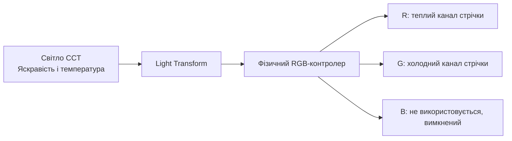
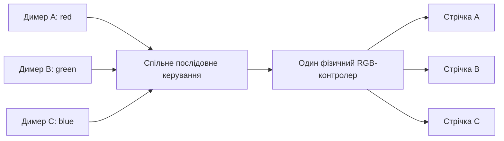
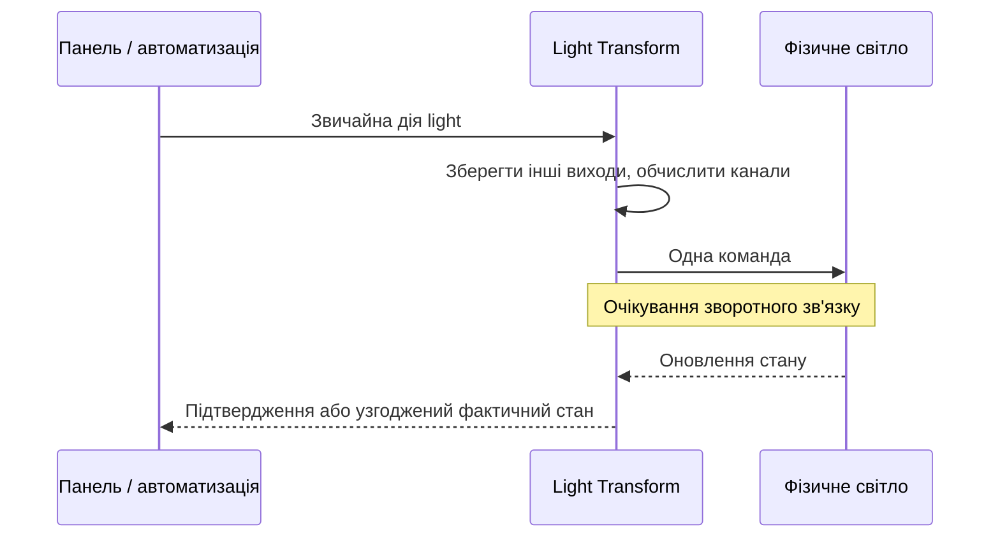
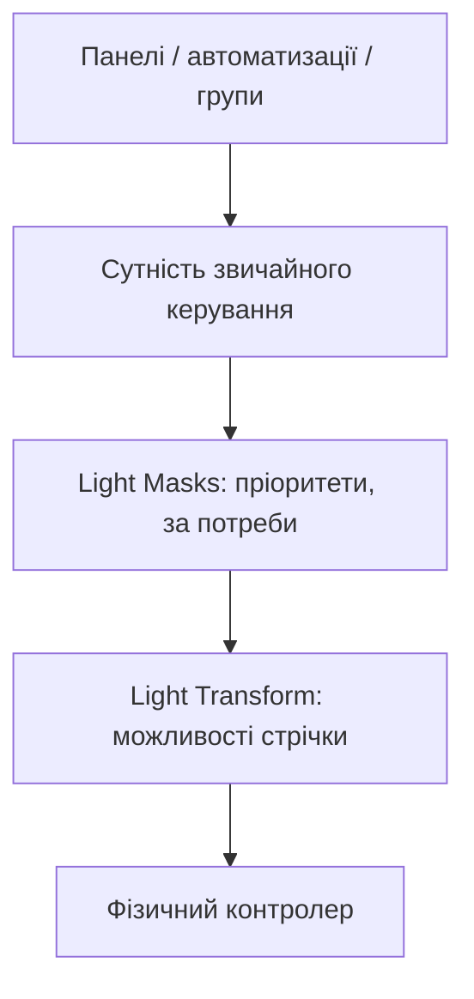

  

# Light Transform

[English](README.md) | Українською

Показуйте можливості **підключеної стрічки**, а не лише ті, які повідомляє контролер.

Інтеграція Home Assistant перетворює канали фізичного світла на звичайні світлові
сутності: CCT із регулюванням температури або димери лише з регулюванням яскравості.
На відміну від Light Masks, вона відповідає за перетворення каналів і можливостей,
а не за пріоритети автоматизацій.

**Версія:** 0.1.0. **Мінімальна версія Home Assistant:** 2026.9.3.
Налаштування через інтерфейс, без YAML чи спеціальних дій.

## Встановлення

1. Скопіюйте каталог `light_transform` із `custom_components` цього проєкту
   в каталог `custom_components` конфігурації Home Assistant і перезапустіть HA.
2. У **Налаштування > Пристрої та служби > Додати інтеграцію** знайдіть
   **Light Transform**.
3. Виберіть фізичне світло й режим керування: **Канали RGB** (`rgb`) для RGB/HS/XY
   або **Колірна температура** (`cct`) для димера з фіксованою температурою.
4. На сторінці інтеграції натисніть **Додати перетворений вихід**. Виберіть тип
   виходу, канали й температури відповідно до підключення.
5. Використовуйте створену сутність у панелях, автоматизаціях, сценах і групах.
   Для редагування чи видалення окремого виходу відкрийте його меню.

Один запис інтеграції керує **всім фізичним джерелом**. Спочатку виходів немає:
кожен додається окремо. Для кількох стрічок одного контролера не створюйте кілька
контролерів — додавайте виходи до одного запису. Канали різних виходів не можуть
перетинатися. Невикористані канали RGB вимикаються під час кожної команди.

Встановлення, додавання, редагування, видалення, перезавантаження інтеграції й
перезапуск HA не надсилають команд на пристрій. Перед зміною підключення чи
призначення каналів вимкніть джерело. Видалення виходу не вимикає його стрічку;
наступна команда до виходу, що залишився, очистить невикористані канали.

### Встановлення через HACS

У HACS відкрийте **Користувацькі репозиторії**, додайте
`https://github.com/gigazet/ha_light_transform` із типом **Інтеграція**,
завантажте **Light Transform** і перезапустіть Home Assistant.
Продовжуйте з кроку 2 вище. Це користувацький репозиторій, а не запис
у стандартному каталозі HACS.

Код і документація: [gigazet/ha_light_transform](https://github.com/gigazet/ha_light_transform).
Про проблеми повідомляйте в [трекері задач](https://github.com/gigazet/ha_light_transform/issues).

## Приклади налаштувань

Усі назви, ідентифікатори й температури нижче умовні. Вибирайте канали та
температури за фактичним підключенням і характеристиками стрічки, а не за
можливостями, які повідомляє контролер. Підключайте лише електрично сумісні
навантаження в межах допустимих параметрів контролера, проводки та блока живлення.

| Підключення | Режим джерела | Виходи |
| --- | --- | --- |
| RGB-контролер зі стрічкою CCT | `rgb` | CCT: теплий **red**, холодний **green**, 2700–6500 K, `constant_sum` |
| RGB-контролер з одноколірною стрічкою | `rgb` | Димер: **red** |
| CCT-контролер із фіксованим білим світлом | `cct` | Один димер: **3000 K** у підтримуваному джерелом діапазоні |
| RGB-контролер із трьома одноколірними стрічками | `rgb` | Три димери: **red**, **green**, **blue**, по одному каналу |
| RGB-контролер зі стрічкою CCT та одноколірною стрічкою | `rgb` | CCT на **red + green**, димер на **blue** |
| RGB-контролер із синхронними одноколірними навантаженнями | `rgb` | Один димер на **red + green**, обидва канали керуються однаково |

Це альтернативні схеми, крім явно вказаних спільних виходів. Наприклад,
`light.rgb_controller` — умовний ідентифікатор фізичного джерела. Ідентифікатори
створених виходів залежать від вибраних назв і реєстру сутностей.

Димер на джерелі CCT надсилає фіксовану температуру **під час кожного ввімкнення**.
Цей режим використовує загальну яскравість і температуру джерела, а не незалежні
електричні теплий/холодний канали. Джерела лише з RGBW/RGBWW не підтримуються.

### Незалежні димери

Через звичайну дію `light.turn_on` задайте димеру A `brightness_pct: 25`,
а димеру B — `brightness_pct: 60`. Вимкнення A збереже рівень B.
Фізична команда Off надсилається лише тоді, коли вимкнено всі виходи.

## Змішування CCT і точність каналів

Температура інтерполюється лінійно в **кельвінах**. Для 2700–6500 K середина
діапазону — **4600 K**. Це модель рівня керування, а не виміряного світлового потоку.

- `constant_sum`, типово: теплий і холодний канали ділять заданий рівень.
  За яскравості 50% у середині діапазону кожен отримує приблизно 25%.
- `constant_max`: сильніший канал дорівнює заданому рівню. У середині діапазону
  за яскравості 50% обидва отримують приблизно 50%. Сумарне навантаження може
  подвоїтися; використовуйте лише за достатньої допустимої потужності обладнання.

Загальна яскравість джерела відповідає найбільшому рівню каналу; RGB задає
нормалізовані співвідношення. Дуже малі рівні обмежені 8-бітним квантуванням.

Для джерел HS/XY атрибут `approximate_channel_control` дорівнює `true`.
Перетворення кольору, обмеження колірного охоплення, гамма та прошивка можуть
змішувати канали. Навіть нативний RGB залежить від поведінки пристрою.
Перевіряйте ізоляцію каналів на малій яскравості, перш ніж покладатися на неї.
Зворотний зв'язок HA — оцінка стану, не електричне вимірювання.

## Поведінка

Виходи CCT підтримують лише `color_temp`, димери — лише `brightness`.
Працюють стандартні On/Off, Toggle, відсотки й кроки яскравості, сцени та групи.
Остання ненульова яскравість і температура зберігаються після перезапуску,
але **стан On не відновлюється зі сховища**. На старті приймається стан джерела.

Недоступне, невідоме, відсутнє чи ввімкнене в несумісному режимі джерело робить
виходи недоступними. Повернення джерела після збою не вмикає його примусово.
Перейменування зареєстрованого джерела відстежується; видалення його запису
не переприв'язує інтеграцію до іншого пристрою з таким самим ідентифікатором.

Помилки дій передаються HA. Успішний виклик ще не доводить доставку:
`delivery_status` показує `pending`, `in_sync`, `feedback_mismatch`,
`command_failed` або недоступність/несумісність джерела.
Очікування триває до п'яти секунд плюс час переходу. До підтвердження показується
бажаний стан; проміжні зміни не затирають наміри інших виходів.
Після тайм-ауту записується попередження і приймається фактичний повідомлений стан
без повторних спроб. Діагностика доступна на сторінці інтеграції.

Плавні переходи передаються лише за підтримки джерелом і діють на весь контролер.
Кінцеві рівні інших виходів зберігаються, але незалежні траєкторії переходів
не гарантовані. Ефекти, спалахи й цикли кольорів не надаються.

## Поєднання з Light Masks

Стрілки показують напрямок команд. Transform має бути **нижче** Masks:
кожен перетворений вихід може мати власне керування пріоритетами.
Не вибирайте джерелом групу, маску чи інший Transform; відомі такі сутності
відхиляються. Обгортки, які приховують свою структуру, не завжди можна розпізнати.

Прямі команди, старі шаблони, Zigbee-групи/прив'язки чи MQTT можуть обійти обидва
шари. Для міграції спершу перевірте споживачів наявних шаблонних світлових
сутностей, створіть відповідні виходи, перевірте підключення та явно змініть
посилання. Встановлення не видаляє шаблони й не перейменовує робочі сутності.
Для відкату збережіть або відновіть попередні цілі керування.

## Мови, логотип і розробка

Інтерфейс налаштування, редагування, помилки й варіанти списків доступні
англійською та українською. Виберіть українську мову у профілі Home Assistant.
Внутрішні значення конфігурації та ідентифікатори сутностей не перекладаються.

Оригінальний логотип показує перетворення RGB-каналів на тепле/холодне біле світло.
PNG у звичайній і подвійній роздільності містяться в
`custom_components/light_transform/brand`; діє ліцензія MIT цього проєкту.
Зовнішні зображення й завантажені шрифти не використовуються.

Команди розробки наведені в [англійській документації](README.md#development).
`scripts/generate_brand.py` відтворює графіку, а `scripts/package_integration.py`
створює `dist\light_transform.zip` з інтеграцією, перекладами й логотипом,
без кешів розробки та байткоду. Тести працюють із симульованим джерелом,
а не з фізичними пристроями.
